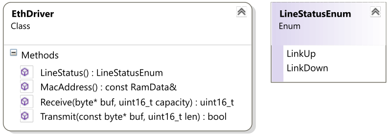
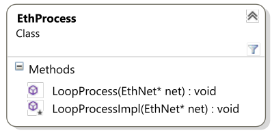
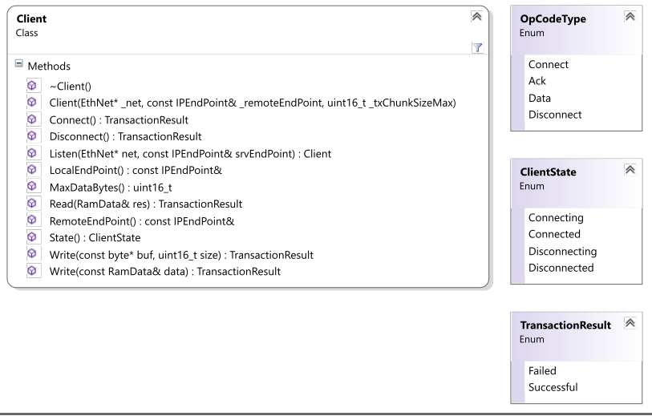

# SearchAThing.Arduino.Net

## Summary

This library if preparatory to the SearchAThing.Arduino.Enc28j60 driver library. In short this is a little network subsystem with following features: 

| item | description |
|---|---|
| IpEndPoint | Simple class to manage ip address and port |
| Checksum | Internet checksum ( [RFC1071](http://www.faqs.org/rfcs/rfc1071.html) [4.1] ) |
| EthernetII | Ethernet protocol |
| ARP | Address Reverse Protocol |
| IP | Internet Protocol |
| ICMP | Internet Control Message Protocol |
| UDP | User Datagram Protocol |
| Ephemeral ports | Temporary port used to track a communication session. |
| DHCP | Dynamic Host Control Protocol |
| DNS | Domain Name Server |
| EthNet | SAT network subsystem |
| EthDriver | Arduino network driver plugin |
| EthProcess | Arduino network subsystem process |
| SRUDP | Simple Realiable UDP |

> For a technical documentation of the API please refer to the documentation contained inside the source code header files accessible through the IDE intellisense. Examples about protocols, network subsystem and ethernet drivers are shown in the SearchAThing.Arduino.Enc28j60 section where a driver for that ethernet controller allow to test real connection data while in this page only theoretical and introductory aspects are explained.

## Source code

To install the library just clone this git repository into your Documents/Arduino/libraries folder. All code excerpts in this page are parts of the [SearchAThing.Arduino.Net.Examples](https://github.com/devel0/SearchAThing.Arduino.Net.Examples) release under MIT license by Lorenzo Delana (C) 2016. 

## Glossary

SAT network subsystem	: refers to the SearchAThing.Arduino libraries involved in the management of the networking and in particular to the EthNet class that responsible to manage network processes.

## IpEndPoint

### Example

```c++
//===========================================================================
// EXAMPLE	: ex01-ipendpoint.ino
//===========================================================================
// Setup()
//   - Allocate an IpEndPoint
// Loop()
//---------------------------------------------------------------------------
// Suggested defines for this example
//---------------------------------------------------------------------------
// SEARCHATHING_DISABLE;DPRINT_SERIAL;SERIAL_SPEED=9600
//

// SearchAThing.Arduino debug macro definitions
#include <SearchAThing.Arduino.Utils\DebugMacros.h>

//---------------------------------------------------------------------------
// Libraries
//---------------------------------------------------------------------------
#include <SearchAThing.Arduino.Utils\Util.h>
using namespace SearchAThing::Arduino;

#include <SearchAThing.Arduino.Net\Protocol.h>
#include <SearchAThing.Arduino.Net\IPEndPoint.h>
using namespace SearchAThing::Arduino::Net;

//---------------------------------------------------------------------------
// Setup
//---------------------------------------------------------------------------
void setup()
{
  auto ip = RamData::FromArray(IPV4_IPSIZE, 192, 168, 0, 80);
  auto port = 50000;

  IPEndPoint endpoint(ip, port);
  
  DPrint(F("EndPoint = ")); DPrintln(endpoint.ToString());
}

//---------------------------------------------------------------------------
// Loop
//---------------------------------------------------------------------------
void loop()
{

}
```

## Checksum

### Example

```c++
//===========================================================================
// EXAMPLE	: ex02-checksum.ino
//===========================================================================
// Setup()
//   - Compute checksum of a byte sequence with single call.
//   - Compute checksum of a byte sequence with multiple calls (partial
//     mode).
// Loop()
//---------------------------------------------------------------------------
// Suggested defines for this example
//---------------------------------------------------------------------------
// SEARCHATHING_DISABLE;DPRINT_SERIAL;SERIAL_SPEED=9600;DEBUG;DEBUG_ASSERT
//

// SearchAThing.Arduino debug macro definitions
#include <SearchAThing.Arduino.Utils\DebugMacros.h>

//---------------------------------------------------------------------------
// Libraries
//---------------------------------------------------------------------------
#include <SearchAThing.Arduino.Utils\Util.h>
using namespace SearchAThing::Arduino;

//#include <SearchAThing.Arduino.Net\Protocol.h>
#include <SearchAThing.Arduino.Net\Checksum.h>
using namespace SearchAThing::Arduino::Net;

//---------------------------------------------------------------------------
// Setup
//---------------------------------------------------------------------------
void setup()
{
  byte buf[] =
  {
    0x45, 0x00, 0x00, 0x28, 0x2e, 0x27, 0x40, 0x00, 0x80, 0x06,
    0x00, 0x00, 0xc0, 0xa8, 0x00, 0x64, 0x6c, 0xa8, 0x97, 0x06
  };

  uint16_t expectedResult = 0x07ee;

  auto checksumOneCall = CheckSum(buf, sizeof(buf));

  uint16_t checksumMultiCall;
  {
    uint32_t pchksum = 0;
    pchksum = CheckSumPartial(pchksum, buf, 10);
    pchksum = CheckSumPartial(pchksum, buf + 10, 10);
    checksumMultiCall = CheckSumFinalize(pchksum);
  }	

  if (checksumOneCall != expectedResult ||
    checksumOneCall != checksumMultiCall)
    DPrintln(F("* checksum failed"));
  else
    DPrintln(F("Checksum matches"));
}

//---------------------------------------------------------------------------
// Loop
//---------------------------------------------------------------------------
void loop()
{

}
```

### Expected output

```
Checksum matches
```

### Description

Computation of the internet checksum is widely used to build valid checksum in protocols such as ip, udp. Here an implementation of the ip chksum based on the [RFC1071](http://www.faqs.org/rfcs/rfc1071.html) [4.1]. In some circumstances its helpful to compute the checksum in a progressive way, for example, when need to compute a checksum over a non-contiguous bytes array ( I used partial checksum to compute the checksum of the [UDP pseudo header](http://www.tcpipguide.com/free/t_UDPMessageFormat-2.htm) ). The only precondition to use partial checksum is that given partial block bytes have an even size ( if the DEBUG;DEBUG_ASSERT enabled a message notify is this condition isn't meet ). 

## EthernetII

### Introduction

Data communication happens when some bits are sent through some device ( wire, radio, etc... - physical layer ) to other nodes in a network. The [Ethernet II](http://www.networksorcery.com/enp/protocol/arp.htm) protocol establish a way to know the identity of the sender and destination node ( MAC ) in a Wide Area Network or in a Local Area Network. It also disambiguate which type of protocol follow in the data communication ( EtherType ). 

### Data structure

```c++
const byte IPV4_TTL = 128;
const byte IPV4_MACSIZE = 6;
const byte IPV4_IPSIZE = 4;

//----------------------------------------------------------
// Eth2
//----------------------------------------------------------

// EthernetII header.
// https://en.wikipedia.org/wiki/Ethernet_frame
typedef struct Eth2Header
{
  // Destination MAC address.
  byte dstMAC[IPV4_MACSIZE];

  // Source MAC address.
  byte srcMAC[IPV4_MACSIZE];

  // EtherType. Use Eth2Type enum to address the type.
  // http://www.cavebear.com/archive/cavebear/Ethernet/type.html
  byte type[2];
};

// EtherType enum.
typedef enum
{
  Eth2Type_UNK = -1,

  // ARP EtherType.
  Eth2Type_ARP = 0x0806,

  // IP EtherType.
  Eth2Type_IP = 0x0800
} Eth2Type;
```

### Usage

EthernetII protocol is widely used in the SearchAThing.Arduino.Net library to send and received data packet cause the first 14 bytes ( MACSIZE + MACSIZE + 2 ) ever contains these informations: 
- dstMAC : destination node MAC address
- srcMAC : source node MAC address
- type : type of the protocol that follows
In a network physical topology the connection between more devices can be done through the use of Switch where all nodes are connected and from which data are sent to respective destination nodes on the base of the dstMAC address. In the older Hub every received packet was sent to all nodes without this check with decreased performance. To ensure we process only packet for our MAC address we'll check if the dstMAC address in the EthernetII header matches our. A special address, called broadcast address (FF:FF:FF:FF:FF:FF), make a packet with that destination to reach every nodes in a network by default and is used when you need to send some data to every nodes or to a specific node that you not know which MAC address is ( for example in an ARP request ). 

## ARP

### Data structure

```c++
//----------------------------------------------------------
// ARP
//----------------------------------------------------------

// ARP Header.
// http://www.networksorcery.com/enp/protocol/arp.htm
typedef struct ARPHeader
{
  // Hardware type. See: ARPType.
  byte hwType[2];

  // Protocol type. See: ARPProtocolType.
  byte protoType[2];

  // Hardware address length. Usually MAC 6 bytes.
  byte hwAddrLength;

  // Protocol address length. For IPv4 this value is 4.
  byte protoAddrLength;

  // ARP OpCode. See: ARPOpcodeType.
  byte opCode[2];
};			

// ARP Type enu.
typedef enum
{
  // ARP Type : Ethernet
  ARPType_Ethernet = 1
} ARPType;

// ARP Protocol type enum.
typedef enum
{
  // ARP Protocol type : IP
  ARPProtocolType_IP = 0x800
} ARPProtocolType;

// ARP Opcode type enum.
typedef enum
{
  // ARP Opcode : Request
  ARPOpCodeType_Request = 1,

  // ARP Opcode : Reply
  ARPOpCodeType_Reply = 2
} ARPOpcodeType;
```

### Usage

This data structures follow an EthernetII header when its type is an `Eth2Type::Eth2Type_ARP`( 0x0806 ). We'll use ARP protocol to respond at broadcast request for Address Resolution: when a node in the network need to send some data to an IP address it need to know its MAC, but if the MAC isn't already known ( arp cache ), a request for address resolution is sent using this data structure with opCode sets to `ARPOpCodeType::ARPOpCodeType_Request` ( 1 ). Every node will process this type of request and the one with matching destination mac ( from the EthernetII header ) respond to the request with another ARP data with opCode set to ARPOpCodeType::ARPOpCodeType_Reply ( 2 ) filling its ip address in the ARPSourceProtocolAddress. Note that the data structure above report only the fixed part of the ARP protocol ( for a full description of the ARP data see [here](http://www.networksorcery.com/enp/protocol/arp.htm) ). 

## IP

### Data structure

```c++
//----------------------------------------------------------
// IPv4
//----------------------------------------------------------

// Internet Protocol Header.
// http://www.networksorcery.com/enp/protocol/ip.htm
typedef struct IPv4Header
{
  // Internet Header Length.
  // Its express a length with a number which units is 4bytes
  // (eg. ihl=5 -> 5 x 4 = 20 bytes )
  // ( 4 bit lower )
  byte ihl : 4;

  // IP protocol version.
  // ( 4 bit higher )
  byte version : 4;

  // Services.
  byte services;

  // Total length of the packet including encapsulated
  // protocols and data. Excluded previous Eth2 header.
  byte totalLength[2];

  // Used for sequence identification.
  byte identification[2];

  // Flags.
  // ( 3 bit higher )
  byte flags : 3;

  // Fragment Offset 
  // ( 5 bits higher )
  byte fragmentOffsetH : 5;

  // Fragment Offset (Low)
  // ( 8 bits lower )
  byte fragmentOffsetL : 8;

  // Time to live.
  byte ttl;

  // Protocol type. See: IPv4Type.
  byte protocol;

  // IPv4 Checksum of the entire IPv4Header only without
  // subsequent encapsulated protocols. Note: the checksum
  // will be computed with the header values except the
  // dummy checksum zeroed.
  // See: IPv4WriteValidChecksum()
  byte chksum[2];

  // Source Ip address.
  byte srcip[4];

  // Destination Ip address.
  byte dstip[4];
};			

// IPv4Type enum.
typedef enum
{
  // IPv4 Protocol type ICMP
  IPv4Type_ICMP = 1,

  // IPv4 Protocol type UDP
  IPv4Type_UDP = 17
} IPv4Type;
```

### Description

If the preceding Eth2 protocol had the `Eth2Type::Eth2Type_IP` ( 0x0800 ) in its type field, then we expect an IP packet structured as shown above. Some important information contained with that are: 
- totalLength : how much bytes the packet is ( included the IP header but excluded the Eth2 header ).
- src/dst ip : ip address of source and destination
- protocol : type of data protocol we expect after this structure

## ICMP

### Data structure

```c++
//----------------------------------------------------------
// ICMP
//----------------------------------------------------------

// Internet Control Message Protocol Header
// http://www.networksorcery.com/enp/protocol/icmp.htm
typedef struct ICMPHeader
{

  // ICMP type. See: ICMPType.
  byte type;

  // ICMP code.
  byte code;

  // ICMP checksum. Its the checksum of the ICMP packet with
  // dummy checksum of 0 excluded Eth2 and IPv4 headers.
  byte chksum[2];
};

// ICMP Echo Header
// http://www.networksorcery.com/enp/protocol/icmp/msg8.htm
struct ICMPEchoHeader
{
  // ICMP Header
  ICMPHeader icmp;

  // Identifier
  byte identifier[2];

  // Sequence number
  byte seqnr[2];
};			

// ICMP Type enum.
typedef enum
{
  // ICMP type Echo Reply.
  ICMPType_EchoReply = 0,

  // ICMP type Echo Request.
  ICMPType_EchoRequest = 8
} ICMPType;
```

### Usage

[ICMP](http://www.networksorcery.com/enp/protocol/icmp.htm) protocol can be used for many purpose, the one implemented here is the ICMP Echo. An ICMP packet follows an IP packet when its protocol field is an `Ipv4Type::Ipv4Type_ICMP` ( 1 ). The SAT network subsystem implements an ICMP responder so that when an ICMP request packet is received ( type == `ICMPType::ICMPType_EchoRequest` ) then a respond to that will be sent changing the type to `ICMPType::ICMPType_EchoReply`. 

## UDP

### Data structure

```c++
//----------------------------------------------------------
// UDP
//----------------------------------------------------------

// Standard UDP server port. DHCP server/client system filters
// udp packets based on these port values.
const byte UDP_PORT_BOOTP_SERVER = 67;

// Standard UDP client port. DHCP server/client system filters
// udp packets based on these port values.
const byte UDP_PORT_BOOTP_CLIENT = 68;

// UDP Header.
// http://www.networksorcery.com/enp/protocol/udp.htm
typedef struct UDPHeader
{
  // Source port.
  byte sourcePort[2];

  // Destination port.
  byte destPort[2];

  // Data length.
  byte length[2];

  // Checksum computed over a pseudo header with dummy chksum=0
  // {srcip, dstip, protocol, udpLen} and UDP header + data.
  // http://www.tcpipguide.com/free/t_UDPMessageFormat-2.htm
  byte chksum[2];
};
```

### Description

A UDP packet follows an IP packet when its protocol field is an `Ipv4Type::Ipv4Type_UDP` ( 17 ). A udp packet introduces some useful informations such as: 
- src/dst ports
- length : how much bytes for the udp data follows the udp header
When you connect to a node with a specific ip address a server software can handle your request, the addition of the port concept distinguish between services that a single ip address can serve on. Some well known UDP ports are used to identify the type of subsequent protocol ( for example an UDP connection incoming onto the BOOTP_SERVER (67) port mean a DHCP request ), but other non standard port >= 49152 can be used for custom services. 

### Ephemeral ports

When use high level API and you connect to a remote endpoint to a specific port, the operating system, take care to allocate a source port for that session, so called ephemeral port ( these ports starts from 49152 ). In the SAT network subsystem this is managed through an IdStorage that handle allocation/deallocation of ephemeral port. The importance to allocate a source ephemeral port is to enable the other end to distinguish between multiple clients that connects the same endpoint/destination port. Different source ip address can have the same ephemeral port ( different OSes ) but the same source ip address must use a different ephemeral port foreach communication session where a source port is needed. 

## DHCP

### Data structure

```c++
//----------------------------------------------------------
// DHCP
//----------------------------------------------------------			

// Bytes count of the DHCP magic cookie.
const byte DHCPMagicCookieSIZE = 4;

// DHCP Header
// http://www.networksorcery.com/enp/protocol/dhcp.htm - size:240
typedef struct DHCPHeader
{
  // DHCP opcode. See: DHCPOpCode.
  byte opCode;

  // DHCP hardware type. See: DHCPHwType.
  byte hwType;

  // Hardware addres length.
  byte hwLength;

  // Hop count.
  byte hopCount;

  // Transaction Id.
  byte transactionId[4];

  // Seconds from last renewal.
  byte nrSeconds[2];

  // Flags
  byte flags[2];

  // Client Ip address.
  byte clientIpAddress[4];

  // Ip assigned by the server.
  byte yourIp[4];

  // Ip of the server during a request. (0 for discover).
  byte serverIp[4];

  // Gateway (0 for discover).
  byte gatewayIp[4];

  // Client MAC
  byte clientHwAddress[16];

  // Server hostname ( 0 )
  byte serverHostname[64];

  // Bootfilename ( 0 )
  byte bootFilename[128];

  // 0x63825363 ( magic cookie bootp )
  byte magic[4];

  // DATA
  //------
  // Data of the DHCP protocol consists of one or more
  // option ( see DHCPOption ) ending with the
  // DHCPOption::DHCPOptionEnd ( 0xff ).				
  //
  // Typical data composition:
  //
  // DISCOVER
  //	0x35 0x01 0x01 (discover)
  //	0xff (end)
  //
  // OFFER
  //	0x35 0x01 0x02 (offer)
  //  0xff (end)
  //
  // REQUEST
  //	0x35 0x01 0x03 (request)
  //  0x32 0x04 a b c d (requested ip address a.b.c.d)
  //  0x36 0x04 a b c d (server identifier a.b.c.d)
  //	0xff (end)
  //
  // ACK
  //	0x35 0x01 0x05 (ack)
  //  0x33 leaseH leaseL (lease time)
  //  0x0c len x x x ... (hostname)
  //  0x0f len x x x ... (domainname)
  //  0x03 0x04 a b c d (gateway)
  //  0x1c 0x04 a b c d (broadcast)
  //  0x06 0x04 a b c d (dns)
  //  0x01 0x04 a b c d (subnet)
  //	0xff ( end )
};

// DHCP opcode enum.
typedef enum
{
  // DHCP request.
  DHCPOpCode_BootRequest = 1,

  // DHCP reply.
  DHCPOpCode_BootReply = 2
} DHCPOpCode;

// DHCP hardware type.
typedef enum
{
  // Ethernet.
  DHCPHwType_Ethernet = 1
} DHCPHwType;

// DHCP Option enum.
typedef enum
{

  // Subnet.
  DHCPOptionSubnetMask = 1,

  // Gateway.
  DHCPOptionGateway = 3,

  // Dns.
  DHCPOptionDns = 6,

  // Domain name.
  DHCPOptionDomainName = 15,

  // Broadcast.
  DHCPOptionBroadcast = 28,

  // Requested ip address.
  DHCPOptionRequestedIpAddress = 50,

  // Lease time.
  DHCPOptionLeaseTime = 51,

  // Msg type.
  DHCPOptionMsgType = 53,

  // Server identifier.
  DHCPOptionServerIdentifier = 54,

  // Hostname.
  DHCPOptionHostname = 12,

  // End.
  DHCPOptionEnd = 0xff
} DHCPOption;

// DHCP message type.
typedef enum
{

  // Discover.
  DHCPMsgTypeDiscover = 1,

  // Offer.
  DHCPMsgTypeOffer = 2,

  // Request.
  DHCPMsgTypeRequest = 3,

  // Ack.
  DHCPMsgTypeAck = 5
} DHCPMsgType;
```

### Description

The SAT network subsystem is able to manage the automatic configuration of ipaddress, and other network information using the DHCP protocol. If you'll choose a dynamic ip configuration that mean you need to receive an ip addres from a DHCP server supposed available on the network. A DHCP server can assign the next available IP in a span of ips for unreserved MAC address of can assign ever the same address if its statically registered a correspondence between requester MAC address and assigned IP. The request for a DHCP configuration is sent over the network to the broadcast address FF:FF:FF:FF:FF:FF and the processing of the respond results in configuration of these network parameters: 

| item | description |
|---|---|
| lease time | 
seconds for which the assigned dhcp client information still valid, after this period another request can update or confirm previously received parameters |
| hostname | textual name that dhcp server assign to the client |
| domain name | name of the domain that dhcp is serving |
| gateway | ip address of the destination to which route packet when the destination ip not fall into the network address space: for example if I request a name resolution using an external internet dns such as the google dns 8.8.8.8 from my lan then the SAT network subsystem will create a packet where the destination IP still 8.8.8.8 but the destination MAC will be the one resolved from the gateway ip address, this way our request can exit through internet from the lan and routed back through the os of our firewall/router that acts as gateway |
| broadcast address | address to which send lan broadcast packets |
| dns | ip address of the DNS server |
| subnet | mask used to compute the network address, can be for example 255.255.255.0 that with an ip of 192.168.0.40 mean you can reach all of the 192.168.0.1-255 ip address without to use the gateway |
| ip address | assigned ip address |

## DNS

### Data structure

```c++
//----------------------------------------------------------
// DNS
//----------------------------------------------------------

// UDP destination port to send request to a DNS server.
const byte UDP_PORT_DNS_SERVER = 53;

// DNS class Internet.
const byte DNS_CLASS_IN = 1;

// DNS qr-code Query.
const byte DNS_QR_CODE_QUERY = 0;

// DNS qr-code Response.
const byte DNS_QR_CODE_RESPONSE = 1;

// DNS query type A. ( Address )
const byte DNS_QUERY_TYPE_A = 1;

// DNS query type MX. (Mail Exchanger)
const byte DNS_QUERY_TYPE_MX = 15;

// DNS Header.
// http://www.networksorcery.com/enp/protocol/dns.htm and
// http://www.networksorcery.com/enp/rfc/rfc1035.txt
typedef struct DNSHeader
{

  // Transaction Id.
  byte id[2];

  // request recursive
  byte rd : 1;

  byte tc : 1;

  byte aa : 1;

  byte opCode : 4;

  // qr-code ( DNS_QR_CODE_{ QUERY, RESPONSE } )
  byte qr : 1;

  byte rCode : 4;

  byte cd : 1;

  byte ad : 1;

  byte z : 1;

  byte ra : 1;

  // Number of questions. We'll issue 1 question TypeA ClassIN
  byte totalQuestions[2];

  // Number of answers. We'll search for first answer
  // TypeA ClassIN
  byte totalAnswer[2];

  // Number of authorities.
  byte totalAuthority[2];

  // Number of additions.
  byte totalAdditions[2];
};
```

### Description

Provided network subsystem allow name resolution through DNS requests. Through a DNS request a name like "www.google.com" can be converted to the correspond IP address. 

## EthDriver

### Class diagram



### Description

EthNet represents the SAT network subsystem and its responsible to manage network processes through the given physical device EthNet drv. Managing such system in a mono-thread environment such the Arduino is not an obvious task and some guidelines need to be followed to ensure the network subsystem itself can continue to work for normal operation such as respond to ARP requests, ICMP echo request or DHCP renewal when lease expire. 

### Rx packet processing

Todo that the user loop function in the Arduino program need to ensure follow statement is executed at least one time at loop: 
```
net->Receive();
net->FlushRx();
```
This way the subsystem will receive a packet if any from the card and process it with pre-registered management processes and if the packet wasn't managed from any of those the `FlushRx()` discard the packet. If you plan to manage some received packet you can follow this guideline: 
```
net->Receive();
if (... packet match my ...)
{
  net->RxMatched();
  ...
}
net->FlushRx();
```
Marking the packet with the `RxMatched()` allow subsequent call to the `Receive()` to retrieve a new rx packet instead to recycle the last not yet matched packet. 

### Network settings

Initialization of the network subsystem can be done through a static ip-address or omitting that using a dynamic dhcp initailization. If used the dhcp mode then the follow network configuration data are available: 
Dns()
DomainName()
Gateway()
Hostname()
IpAddress()
Netmask()
otherwise you can set all of these using the approriate `Set...()` function. 

### Resolving IP and MAC

Resolution of IP address mean basically to retrieve the IP address given the name ( through the use of a DNS request ). Resolution of a MAC address its used in ethernet2 packet composition and mean to retrieve the MAC address given the ip ( through the use of an ARP request ). 

## EthProcess

### Class diagram



### Description

EthProcess is an abstract class used by the SAT network subsystem to design network process that can be registered as default handler for some type of matched packet data. Basically the LoopProcess() is a wrapper to avoid re-entrancy at the LoopProcessImpl() user defined protected function, in fact at every packet receive the subsystem will query for any registered process able to handle such packet by executing the "thread"-safe LoopProcess function. The SAT network subsystem provides follow predefined processes : 

| item | description |
|---|---|
| ARPRespondProcess | Ethernet process that responds to ARP requests which destination ip address matches our in order to allow discover our MAC address to request client |
| ICMPRespondProcess | Handles ICMP echo request and respond with appropriate packet. |
| DhcpClientProcess | Ethernet process that search a dhcp server in order to configure our network based on our MAC address. After the process configured the network parameters for the first time it will recheck if obtained lease expired and in case it will update dhcp client configuration again. DHCP client configuration informations that will be requested to the DHCP server are: lease, hostname, domainname, gateway, broadcast, dns, netmask |

## SRUDP

### Data structure

```c++
//----------------------------------------------------------
// SRUDP
//----------------------------------------------------------

// SRUDP Header.
typedef struct SRUDPHeader
{

  // Connect request ( octet lower bit ).
  byte connect : 1;

  // Notify an Ack ( received message `id' ).
  byte ack : 1;

  // Message contains Data.
  byte data : 1;				

  // Request Disconnect.
  byte disconnect : 1;

  // (octet padding)
  byte pad : 4;

  // Sequence identifier. Each ends starts its own transmitted
  // packet with sequence from 0 and increment at each
  // new transmitted packet after it received correspondent
  // acknowledge. At the same time each ends manage a separate
  // rx Id that starts from 0 to state right sequence of
  // incoming packets from the other ends.
  byte id[2];
  
  // This packet data len.
  byte dataLen[2];

  // Data len left that expects over next packets.
  byte dataLenLeft[2];

};
```

### Class diagram



### Introduction

Sending and receiving of data through network is something that seems to be simple from an high level api, but in the underneath levels there is a protocol that takes care the encapsulated data reach the other end. At a lower level when you sent a packet over the wire there aren't guarantees that its received from the other end. Usually who sends a packet need to receive an acknowledge that the packet was received. The problem is that the other end not know if you receive that acknowledge so he can't state if received message has to be processed or not. Here we going to describe a protocol based on simple udp datagram to establish a reliable communication between parties

### Audience

I started this project to allow me to talk to arduino using the enc28j60. While there are some libraries on the net that already manages the enc28j60 and the tcp/ip I decided to develop a driver plus a simple protocol based on the udp to have more controls to which happens on the communication layer. 

### Network scenario

#### Ack in time


In the situation explained in the above figure the sender A successfully sends the message to B and receive an acknowledge before the ack timeout. 

#### Ack lost


In this scenario the message was sent successfully, then the other party B process the message doing some job, but for some reason the acknowledge failed. In this case the message originator will send the entire message again when the ack timeout expire and then the party B need to know that previous seen message, already processed, need to be skipped to avoid a new processing. An acknowledge will be sent back to the message originator to let him know that the message was received.
 
#### Connection lost


In this specific case the message was received and processed by the other party B but A was not able to receive the ack before the connection timeout. In this scenario the connection must be reestablished

#### Message and ack differences

The key concept between a packet containing data ( message ) and a packet containing only an ack, is the fact that while the message still being delivered until an ack is received, the ack packet is transmitted in a shoot-and-forget mode. This let to brake the infinite recursion between parties: only one side take care to re push the packet, the side of the message. 

### SRUDP protocol structure

- [Ethernet II](http://networksorcery.com/enp/protocol/ethernet.htm)
- [IPv4](http://www.networksorcery.com/enp/protocol/ip.htm)
- [UDP](http://www.networksorcery.com/enp/protocol/udp.htm)
where the UDP datagram follow this structure:

| offset (byte) | size (bytes) | description |
|---|---|---|
| 0 | 1 | opcode |
| 1 | 2 | id |
| 3 | 2 | dataLen | 
| 5 | 2 | dataLenLeft |
| 7 | PKTCDATA | custom data |

where PKTCDATA = ipv4->totalLength - sizeof(IPv4Header) - sizeof(UDPHeader) - sizeof(SRUDPHeader) 

#### opCode bits

| bit | description |
|---|---|
| 3 | disconnect : 1 if this packet is the last of the client session |
| 2 | data : 1 if the packet contains data to deliver |
| 1 | ack : 1 if the packet is an ack to a received one |
| 0 | connect : 1 for the first packet of a new client session |

#### id

Id is an unsigned 16-bit integer ranges from 0-65535 and this allow each sent packet to be differentiated so the counterpart expect to receive some packets following a sequence that starts from 0 an continue until overflow and again restart from 0. Substantially the id serve for the packet skipping process for those packet already received but for which the counterpart not yet received an acknowledge. This choice came after evaluating that: 
- The use of the checksum is not enough, in fact it ensure only that two packets are different when their checksum differs, but not ensure that two packets are the same only on the checksum equality (due to possible function value collision).
- Use of a short range integer ( for example a bit { 0, 1 } ) cannot guarantee the right packets sequence of arrival: in some situations, generally a network slow down, or link down, the sender not receive the ack and sends the packet again and again, and this zombie packet can be mixed up with some subsequent in order packets casing a misleading identification of the current packet to process.

### Data communication

#### Client, server and protocol state information

Another interesting point in the implementation of a network protocol is in the identification of the client and server roles. What mean that a client connects a server at the udp port 50000 and what mean that a sever accepts that connection ? Simply this process is a communication between the parts using packets and following a protocol specification. From the protocol point of view the client and the server acts in the same manner, each one will process packets applying the protocol specification paths. From the implementation point of view: 
- client 
	- processes only those incoming packets with udp destination port equals to the initial source port of the connection
- server 
	- process any packet with udp destination declared as the connection endpoint listener
This difference implies that while the server need to maintain tracks foreach new client of its source udp port plus other protocol state information such as packet id clients instead need to keep track only for its connection channel. 

##### Client and server roles

The fact that the server listening for incoming client connections doesn't mean that the server executes passively what the client instruct for. The choose of the parties roles is completely arbitrary to the type of the applications we going to implement. We can have in general a bidirectional communication between the server and client, some typical examples are: 
- server slave : the server only respond to the client commands
- client slave : the server wait for the client to publish him into the network to use him
- sever/client slave : the server wait for the client to publish him into the network to receive client commands and to use him

Examples: 
- server slave : the server has a temperature sensor and the client connects to it to read data
- client save : the client has a temperature sensor and when the client notifies itself to the server then the server start to gather data from him
- server/client slave : the client has a display and a button while the server has a relay. When the client publishes itself then the server start to write to the client some information that its shows to the display (client slave). When the client detects the button pushed it call a function of the server (server slave).

### Implementation keynotes

#### General

- **udp fragmentation** : to reduce complexity in protocol management on IoT devices the udp client must not fragment its packets
- **client modes**
	- *proper client*
		- the remote endpoint is the server which the client is connecting to
		- the local endpoint is on an ephemeral port
	- *wrapper client*
		- the remote endpoint is the other-side connecting client
		- the local endpoint is the same of the listener ( ie. the packets coming out from the listener differentiates between more connected clients by the destination address )
		
#### Client

- **receiving packets**
	- *proper client* : it has an autonomous receiver thread that handles incoming packet which origin matches the expected remote endpoint and forwards these packets to the internal packet handler
	- *wrapper client (listener side)* : forwards incoming packet whose origin (remote endpoint) matches the connected client to the client internal receive packet handler 
		- client connected notification : if a packet of type Connect came from an unconnected client origin, then a custom override able handler will be called
	- **internal receive packet handler**
		- *Data* : if a packet of type Data was received 
			- if its id is equals to the current (receiveId-1) this mean that the other side client not received the ack or the ack was lost, then simply send the ack without processing the packet action
			- if the id matches the current receiveId then save the packet and notify internally that a data packet was received to allow the processing
			- otherwise is an invalid packet
		- *Connect* : if the packet id is equal to 0 or 1 send a confirmation ack and then set the receivedId to 1. If the packet id was 1 that mean the other party not received the ack.
		- *Disconnect* : set the connection state to disconnected, then call the custom disconnect handler and send the ack
		- *Ack* : save the ack packet and notify internally that an ack packet was received to allow processing
	- **user read function** : the user can call the read function to block the client until a packet was read 
		- if the client state is disconnected then generates an SRUDPClientDisconnected exception
		- to read the data loop over the received packets from the internal received packet handler until the packet has a Continue bit option set
		- return the composed message as concatenation of all received packets messages
- **write**
	- *write chunk* : this function expects a message which lengths is less or equals to the maximum length of a message in the packet as per protocol used. 
		- loop over the time until the connection timeout expire 
			- send the packet ( message chunk ) to the remote endpoint
			- wait until ack timeout expire to check if a packet with expected transmitted packet id is received ( in this case return from the function ), otherwise continue until connection timeout expires trying again
	- *write arbitrary message* : this function loop over the write chunk function partitioning the message into chunks of the length as specified in the protocol message max size, using the continuation flag sets as true for all chunks expects the last one
- **connect** : like the write chunk function using the continuation flag set to false, sends a Connect type message and wait for an ack. If the ack was received increase the internal packet id and set the state of the client to Connected.
- **disconnect** : like the write chunk function using the continuation flag set to false, sends a Disconnect type message and wait for an ack. If the ack was received sets the internal packet id to 0 and set the state of the client to Disconnected

#### Listener

- **start** : enable the listener to receive connections with a loop 
	- distinguish clients by their origin ipendpoint
	- forward received data to the internal receive handler of the selected client
- **stop** : disable the listener
